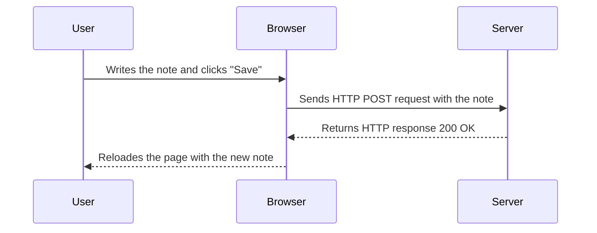

```mermaid
sequenceDiagram
    participant User
    participant Browser
    participant Server

    User->>Browser: Writes the note and clicks "Save"
    Browser->>Server: Sends HTTP POST request with the note
    Server-->>Browser: Returns HTTP response 200 OK
    Browser-->>User: Reloades the page with the new note
```
