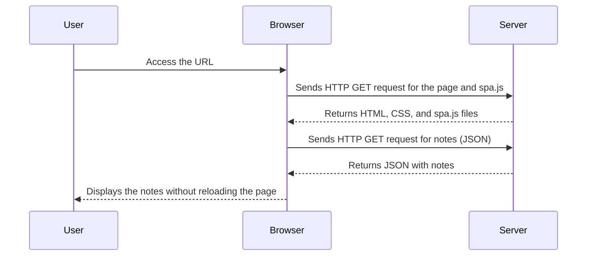

```mermaid
sequenceDiagram
    participant User
    participant Browser
    participant Server

    User->>Browser: Access the URL
    Browser->>Server: Sends HTTP GET request for the page and spa.js
    Server-->>Browser: Returns HTML, CSS, and spa.js files
    Browser->>Server: Sends HTTP GET request for notes (JSON)
    Server-->>Browser: Returns JSON with notes
    Browser-->>User: Displays the notes without reloading the page
```
