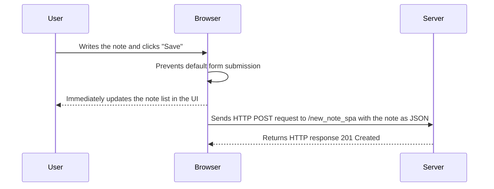

```mermaid
sequenceDiagram
    participant User
    participant Browser
    participant Server

    User->>Browser: Writes the note and clicks "Save"
    Browser->>Browser: Prevents default form submission
    Browser-->>User: Immediately updates the note list in the UI
    Browser->>Server: Sends HTTP POST request to /new_note_spa with the note as JSON
    Server-->>Browser: Returns HTTP response 201 Created
```
